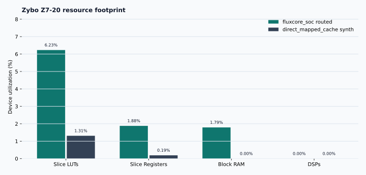
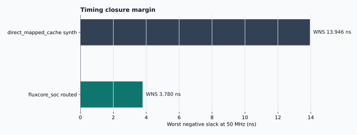

<p align="center">
  
</p>

<h1 align="center">F L U X C O R E</h1>
<p align="center"><em>A compact RV32IMXFlux FPGA processor for sparse-kernel measurement</em></p>

<p align="center">
  
  
  
  
  
</p>

FluxCore is a handwritten SystemVerilog RISC-V processor with a bare-metal software flow, focused RTL verification, Rocq/Coq proof artifacts, and a reproducible Vivado path to a standalone Zybo Z7-20 bitstream. The current artifact is not a speculative architecture diagram: it includes synthesizable RTL, BRAM-backed SoC integration, machine-mode counters, RV32M execution, XFlux custom helper instructions, software benchmarks, IMEM image generation, directed testbenches, and saved implementation reports.

The design is intentionally small enough to inspect. `fluxcore_soc` exposes only `clk` and `rst`, connects the core to local instruction/data BRAMs, and keeps retirement/exception signals available for debug. A parameterized direct-mapped D-cache path is present, but the default measured SoC configuration remains cacheless BRAM.

---

## Contents

- [**Snapshot**](#snapshot) - what currently exists and what is measured
- [**Visual preview**](#visual-preview) - generated pipeline, architecture, memory, and report figures
- [**Architecture**](#architecture) - processor, memory, CSR, and cache shape
- [**ISA surface**](#isa-surface) - RV32I, RV32M, and XFlux coverage
- [**Software flow**](#software-flow) - startup, linker, runtime, benchmarks, IMEM generation
- [**Compiler layer**](#compiler-layer) - FluxCC target contract and integration path
- [**Verification**](#verification) - unit, integration, SoC, and formal targets
- [**FPGA results**](#fpga-results) - routed utilization, timing, and cache synthesis
- [**Runbook**](#runbook) - setup, build, test, and Vivado commands
- [**Repository map**](#repository-map) - where the project lives
- [**Boundaries**](#boundaries) - things the README does not claim

---

## Snapshot

| Layer | Current state |
|---|---|
| Core | Five-stage, in-order, single-issue RV32 pipeline |
| ISA | RV32I + RV32M + XFlux helpers in `CUSTOM_0` space |
| Privilege | Machine-mode CSR/trap subset with ECALL and MRET |
| Counters | `mcycle`/`mcycleh` and `minstret`/`minstreth` |
| Hazards | EX/MEM and MEM/WB forwarding, load-use stall, redirects, divider/cache stall input |
| Default memory | BRAM instruction memory and byte-enabled BRAM data memory |
| Optional cache path | Direct-mapped write-through D-cache selected by `USE_DCACHE=1` |
| Software | Bare-metal startup, linker, runtime helpers, benchmark build targets |
| Benchmarks | `hello_cpi` arithmetic loop and 8x8 CSR SpMV source programs |
| Simulation | Questa-oriented targets plus an XSim-compatible runner path |
| Formal | Rocq/Coq target for the proof set listed in `verification/formal/Makefile` |
| FPGA | Vivado non-project synth, implementation, and bitstream scripts |

Measured FPGA snapshot from saved Vivado 2023.1 reports:

| Artifact | Evidence | Result |
|---|---|---|
| `fluxcore_soc` | `reports/implementation/fluxcore_soc_utilization_route.rpt` | 3,313 LUTs, 2,003 registers, 2.5 BRAM tiles |
| `fluxcore_soc` | `reports/implementation/fluxcore_soc_timing_summary_route.rpt` | WNS 3.780 ns at 50 MHz |
| `fluxcore_soc` | `reports/implementation/fluxcore_soc_route_status.rpt` | 4,844 / 4,844 routable nets fully routed |
| `direct_mapped_cache` | `reports/synthesis/direct_mapped_cache_utilization_synth.rpt` | 699 LUTs, 200 registers, 0 BRAM, 0 DSP |
| `direct_mapped_cache` | `reports/synthesis/direct_mapped_cache_timing_summary_synth.rpt` | WNS 13.946 ns at 50 MHz |

---

## Visual Preview

<p align="center">
  
</p>

<p align="center"><em>Five-stage instruction flow through IF, ID, EX, MEM, and WB. Generated from <code>scripts/generate_readme_assets.py</code>.</em></p>

<p align="center">
  
</p>

<p align="center"><em>The default SoC is a BRAM-first vertical slice. The D-cache path exists behind a parameter; the routed snapshot below is the default BRAM configuration.</em></p>

<p align="center">
  
</p>

<p align="center">
  
</p>

---

## Architecture

FluxCore is built around a conventional five-stage pipeline, with explicit stage registers and small control blocks rather than hidden generated IP.

```text
Instruction Fetch
      |
Instruction Decode / Register Read
      |
Execute
      |
Memory
      |
Writeback
```

| Property | Value |
|---|---|
| RTL style | Handwritten SystemVerilog |
| Datapath width | 32-bit |
| Register file | 32 x 32-bit, async read, sync write, hardwired `x0` |
| Reset convention | Synchronous, active-high internal reset |
| Reset vector | `0x00000000` by default |
| Trap vector | `0x00000100` by default |
| Top-level module | `rtl/top/fluxcore_soc.sv` |
| FPGA top-level ports | `clk`, `rst` |
| Debug visibility | Internal `dbg_*` retirement and exception nets are preserved |

### Pipeline Blocks

| Stage | Main RTL | Role |
|---|---|---|
| IF | `rtl/frontend/fetch_unit.sv` | PC sequencing, next-PC fetch timing |
| ID | `rtl/decode/decoder.sv`, `rtl/common/regfile.sv` | Decode, register read, immediate generation |
| EX | `rtl/execution/alu.sv`, `branch_unit.sv`, `mul_div_unit.sv` | ALU, branches, jumps, RV32M operations |
| MEM | `rtl/memory/mem_stage.sv` | Load/store alignment, byte lanes, memory control |
| WB | `rtl/core/wb_stage.sv`, `csr_unit.sv` | Register writeback, CSR effects, retire events |
| Control | `pipeline_ctrl.sv`, `forwarding_unit.sv` | Forwarding, stalls, redirects, trap/MRET control |

---

## ISA Surface

| Group | Instructions | Status |
|---|---|---|
| RV32I ALU | ADD, SUB, AND, OR, XOR, SLL, SRL, SRA, SLT, SLTU and I-type forms | Implemented |
| RV32I memory | LW, LH, LB, LHU, LBU, SW, SH, SB | Implemented |
| RV32I branch | BEQ, BNE, BLT, BGE, BLTU, BGEU | Implemented |
| RV32I jump | JAL, JALR | Implemented |
| RV32I immediate | LUI, AUIPC | Implemented |
| RV32I system | ECALL, MRET, CSR read/write/set/clear forms | Implemented |
| RV32M multiply | MUL, MULH, MULHU, MULHSU | Implemented, combinational |
| RV32M divide | DIV, DIVU, REM, REMU | Implemented, 33-cycle iterative divider |
| XFlux | XLIDX, XABS, XMIN, XMAX, XCLZ | Implemented in `CUSTOM_0` space |

The implemented machine CSR set includes `mstatus`, `mtvec`, `mscratch`, `mepc`, `mcause`, `mtval`, `mip`, `mcycle`, `mcycleh`, `minstret`, `minstreth`, and `mhartid`. Counter CSRs are used by the benchmark runtime instead of the user-mode `rdcycle`/`rdinstret` pseudo-instruction addresses.

---

## Memory System

<p align="center">
  
</p>

The default SoC uses separate instruction and data memories. Both address spaces begin at zero because they are separate physical BRAM buses, not one unified address space.

| Memory | Default depth | Byte range | Notes |
|---|---:|---|---|
| IMEM | 4096 words | `0x0000_0000` to `0x0000_3FFF` | `$readmemh` program image, 16 KiB |
| DMEM | 2048 words | `0x0000_0000` to `0x0000_1FFF` | Byte write strobes, 8 KiB |
| Stack | n/a | grows down from `0x0000_2000` | Initialized by `software/startup/crt0.S` |
| Result block | 8 words | `0x0000_1FE0` to `0x0000_1FFF` | Runtime writes magic, counters, checksum, extras, done |

### Optional D-cache Path

`rtl/top/fluxcore_soc.sv` can instantiate `rtl/cache/dcache.sv` when `USE_DCACHE=1`.

| Cache property | Current value |
|---|---|
| Organization | Direct-mapped |
| Line size | One 32-bit word |
| Default line count | 64 |
| Write policy | Write-through, no-write-allocate |
| Load miss behavior | One added stall cycle, then refill from BRAM |
| Counters | 32-bit wrapping hit and miss counters exposed by the module |

---

## Software Flow

FluxCore has enough bare-metal infrastructure to compile C benchmarks into IMEM hex files and run them in the full-SoC simulation harness.

| Component | Path | Role |
|---|---|---|
| Startup | `software/startup/crt0.S` | Entry point, stack setup, BSS clearing, call `main` |
| Linker | `software/linker/fluxcore.ld` | Places executable image in IMEM and exports DMEM stack top |
| Runtime | `software/runtime/fluxcore.h` | Reads machine counters and writes the result block |
| Hex conversion | `scripts/elf2hex.py` | Converts ELF to `$readmemh`-compatible IMEM image |
| Benchmarks | `software/benchmarks/*.c` | `hello_cpi` and CSR SpMV workloads |

Current benchmark sources:

| Program | What it does | Correctness signal |
|---|---|---|
| `hello_cpi.c` | 1000-iteration arithmetic loop around counter reads | checksum `499500` |
| `spmv_csr.c` | 8x8 integer CSR sparse matrix-vector multiply | checksum `416` |

Benchmark programs call `fluxcore_report()`, which writes:

```text
RESULT_BASE + 0   magic     0xF10CCAFE
RESULT_BASE + 4   cycles
RESULT_BASE + 8   retired instructions
RESULT_BASE + 12  checksum
RESULT_BASE + 16  extra0
RESULT_BASE + 20  extra1
RESULT_BASE + 24  extra2
RESULT_BASE + 28  done      0x600DD00E
```

The SoC benchmark testbench watches DMEM stores to this block, prints cycles/instructions/CPI/checksum, verifies the checksum, and finishes when the done sentinel appears.

---

## Compiler Layer

FluxCC should make FluxCore usable from ordinary systems languages. The combined
project is most relevant if the compiler accepts freestanding C first, then a
restricted freestanding C++ subset, and lowers those programs to FluxCore
machine code.

The current connected target profile is:

```text
fluxcore-bram-rv32imxflux-v0
```

That profile is RV32I/RV32M/XFlux-scalar, single-hart, BRAM-backed, and
integer-only for compiler bring-up. It deliberately excludes FP32, hardware
threading, scratchpad, DMA, AXI/DDR, gather4/spdot4, hosted libc, exceptions,
RTTI, and PCG until matching FluxCore RTL/runtime support exists.

Compiler integration docs:

- `docs/compiler/fluxcc-integration.md` - human-readable target contract
- `docs/compiler/fluxcore-target-v0.yaml` - machine-readable target profile
- `docs/compiler/chatgpt-prompt.md` - paste-ready prompt for adapting FluxCC

The first clean end-to-end path should be:

```text
C / restricted C++
  -> frontend representation
  -> FluxIR
  -> FluxCore Machine IR
  -> GNU RV32 assembly
  -> ELF
  -> scripts/elf2hex.py
  -> fluxcore_soc IMEM_INIT
```

FluxCC should be implemented primarily in Rust, with C ABI glue where useful.
Full C++ parsing should come through Clang/libclang or LLVM IR import rather
than a hand-written C++ frontend.

---

## Verification

<p align="center">
  
</p>

Verification is layered around small self-checking benches and Makefile targets.

| Layer | Representative targets |
|---|---|
| Unit RTL | `alu-test`, `decoder-test`, `regfile-test`, `csr-unit-test`, `dcache-sim` |
| Pipeline registers/control | `if-id-reg-test`, `id-ex-reg-test`, `pipeline-ctrl-test`, `forwarding-unit-test` |
| ISA integration | `rv32i-alu-test`, `rv32m-test`, `branch-compare-test`, `jal-jalr-test` |
| Memory integration | `lw-sw-test`, `byte-halfword-test`, `bram-imem-test`, `bram-dmem-test`, `dcache-e2e-test` |
| Control/trap flow | `branch-integ-test`, `lui-auipc-test`, `ecall-mret-test` |
| Full SoC software | `sim-hello-cpi`, `sim-spmv-csr` |
| Formal | `formal-verify` |

The formal target compiles the proof set listed in `verification/formal/Makefile`: `FluxCoreTypes.v`, `FluxCoreISA.v`, `FluxCorePipeline.v`, `PipelineCorrectness.v`, and `FluxCoreSPMV.v`.

---

## FPGA Results

The current saved implementation snapshot targets Zybo Z7-20 (`xc7z020clg400-1`) with Vivado 2023.1 and a 20 ns clock constraint.

| Metric | Routed `fluxcore_soc` result |
|---|---:|
| Slice LUTs | 3,313 / 53,200 = 6.23% |
| Slice registers | 2,003 / 106,400 = 1.88% |
| Block RAM tiles | 2.5 / 140 = 1.79% |
| DSPs | 0 / 220 = 0.00% |
| Routable nets | 4,844 / 4,844 fully routed |
| Timing | WNS 3.780 ns, TNS 0.000 ns |
| Bitstream | `build/vivado/fluxcore_soc.bit` |

Standalone direct-mapped cache synthesis snapshot:

| Metric | `direct_mapped_cache` synth result |
|---|---:|
| Slice LUTs | 699 / 53,200 = 1.31% |
| LUT as distributed RAM | 338 |
| Slice registers | 200 / 106,400 = 0.19% |
| Block RAM tiles | 0 / 140 = 0.00% |
| DSPs | 0 / 220 = 0.00% |
| Timing | WNS 13.946 ns at 50 MHz |

Primary evidence files:

- `reports/implementation/fluxcore_soc_utilization_route.rpt`
- `reports/implementation/fluxcore_soc_timing_summary_route.rpt`
- `reports/implementation/fluxcore_soc_route_status.rpt`
- `reports/implementation/fluxcore_soc_drc_bitstream.rpt`
- `reports/synthesis/direct_mapped_cache_utilization_synth.rpt`
- `reports/synthesis/direct_mapped_cache_timing_summary_synth.rpt`

---

## Runbook

Set up Python tooling:

```bash
make setup
source .venv/bin/activate
make check
```

Configure local tool and board values:

```bash
cp config/tools.example.mk config/tools.local.mk
cp config/board.example.mk config/board.local.mk
make show-config
```

Build benchmark IMEM images:

```bash
make sw-all
```

Run common RTL and SoC checks:

```bash
make integration-test
make rv32i-alu-test
make rv32m-test
make byte-halfword-test
make branch-compare-test
make dcache-e2e-test
make sim-hello-cpi
make sim-spmv-csr
```

Run formal proof compilation:

```bash
make formal-verify
```

Run the FPGA flow:

```bash
make vivado-check
make vivado-synth
make vivado-impl
make vivado-bitstream
make vivado-cache-synth
```

Regenerate README visuals:

```bash
python3 scripts/generate_readme_assets.py
```

---

## Repository Map

```text
FluxCore/
|-- rtl/
|   |-- common/        architectural packages and shared leaf units
|   |-- core/          pipeline top, CSR unit, control, forwarding, writeback
|   |-- decode/        instruction decoder
|   |-- execution/     ALU, branch unit, RV32M unit, execute stage
|   |-- frontend/      fetch unit
|   |-- memory/        memory-stage datapath
|   |-- pipeline/      stage registers
|   |-- cache/         direct-mapped data cache blocks
|   `-- top/           BRAM memories and `fluxcore_soc`
|-- verification/      SystemVerilog tests, filelists, and Rocq/Coq proofs
|-- software/          bare-metal startup, linker, runtime, and benchmarks
|-- vivado/            constraints and non-project Tcl scripts
|-- synth/             synthesis filelists and report analysis scripts
|-- reports/           saved synthesis and implementation reports
|-- docs/              design notes and project records
|   `-- compiler/      FluxCC target contract, YAML profile, and prompt
|-- models/            Python support model and tests
|-- scripts/           utility scripts and generated-asset tooling
|-- config/            example and local tool/board configuration
`-- figures/           README logo and generated diagrams
```

---

## Boundaries

FluxCore does not currently claim an AXI/DDR memory path, ARM PS host-control interface, UART, operating system, virtual memory, multicore coherence, superscalar issue, out-of-order execution, FP32 unit, gather/scatter engine, or PCG benchmark. XFlux `XMACC` is reserved in the ISA package comments but is not implemented in the current RTL.

The saved SoC benchmark log under `build/` is not treated as project evidence because local build outputs are generated artifacts and may reflect missing local IMEM files or local tool state. Performance, timing, utilization, and correctness claims in this README should be backed by checked-in source, Makefile targets, or saved reports under `reports/`.
