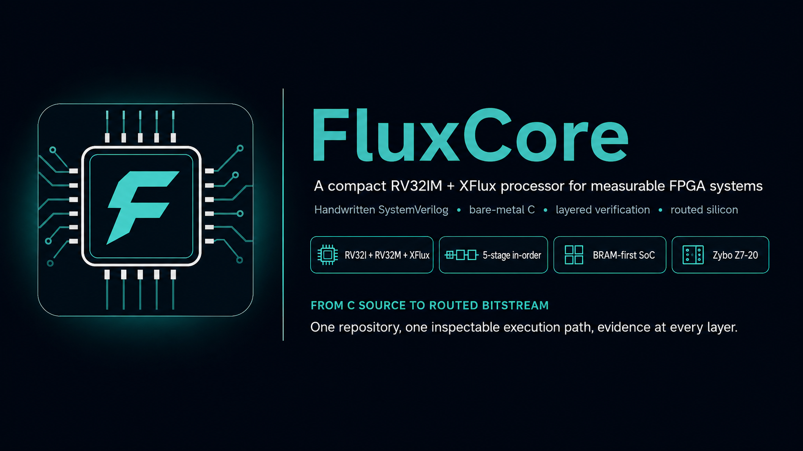
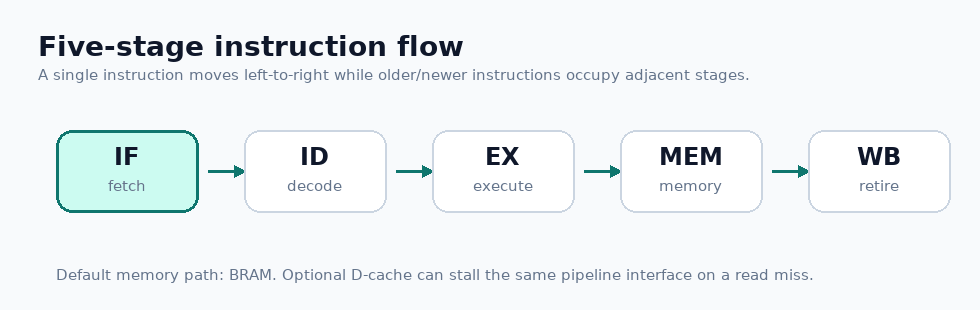
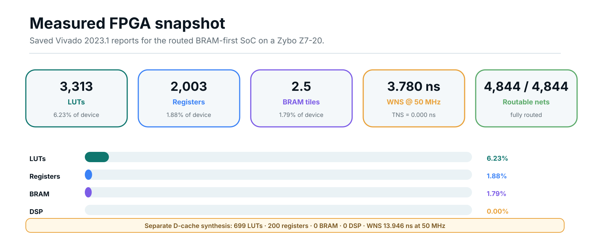
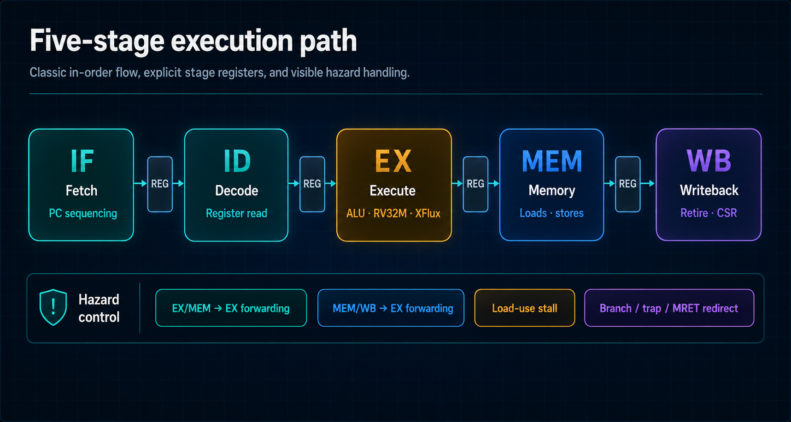
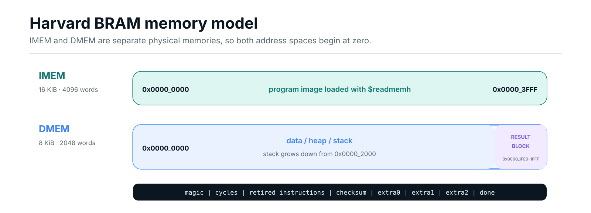
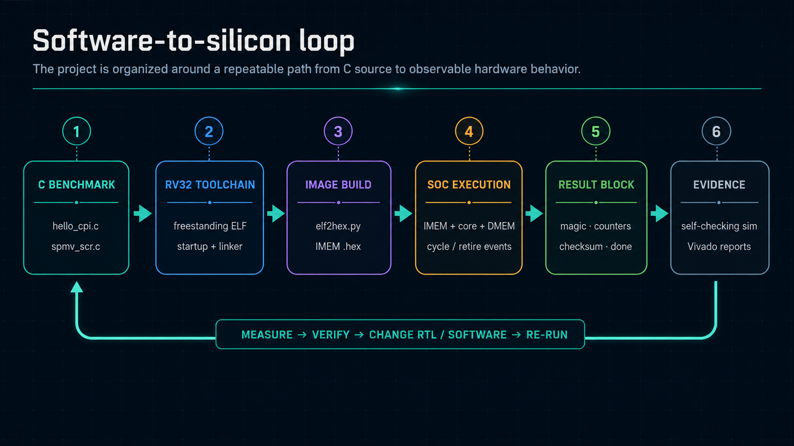
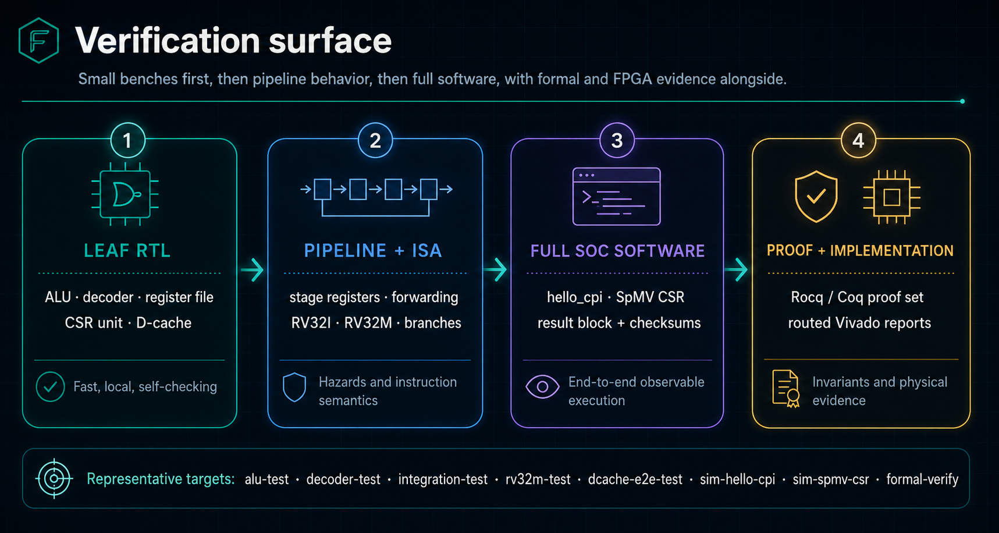

<p align="center">
  
</p>

<h1 align="center">F L U X C O R E</h1>
<p align="center"><em>A measurement-first RISC-V processor: one handwritten vertical slice from bare-metal C to a routed FPGA bitstream</em></p>

<p align="center">
  
  
  
  
  
  
</p>

FluxCore is a handwritten five-stage RV32 processor built as a controlled experiment in **owning every layer of the stack**: ISA definition, pipeline RTL, hazard control, machine-mode CSRs and traps, custom instructions, BRAM-backed SoC integration, bare-metal software, layered simulation, machine-checked proofs, and a routed Vivado implementation. Nothing is hidden behind generated IP. The primary result is not just a working core — it is the *evidence chain* that connects a C source file to cycle counts, checksums, timing slack, and utilization on real silicon primitives.

> **Rule of the repo:** no claim about a feature is valid unless it is backed by checked-in source, a Makefile target you can run, or a saved report under `reports/`. This README follows that rule; every number below states where it comes from.

---

## Contents

- [**Introduction**](#introduction) — the research question and why a vertical slice
- [**Design hypotheses**](#design-hypotheses) — the falsifiable bets the microarchitecture makes, and where each is tested
- [**Sneak peek**](#sneak-peek) — the pipeline in motion and the routed-implementation scorecard
- [**Why FluxCore matters**](#why-fluxcore-matters) — positioning against generated-IP and black-box cores
- [**Background**](#background) — how classic architecture ideas map onto this repo, with references
- [**The complete system**](#the-complete-system) — SoC contract, pipeline, ISA surface, memory system
- [**Software-to-silicon loop**](#software-to-silicon-loop) — from C to `$readmemh` to measured counters
- [**Verification & evidence**](#verification--evidence) — what each layer establishes, and what it does not
- [**Results (current snapshot)**](#results-current-snapshot) — implementation story and benchmark scoreboard
- [**AI usage and division of work**](#ai-usage-and-division-of-work) — process transparency
- [**Repository map**](#repository-map) — directory-by-directory navigation
- [**Known limitations**](#known-limitations) — stated plainly, with the roadmap that addresses them
- [**Appendix**](#appendix-setup-and-reproduction) — setup and exact reproduction commands per artifact

---

## Introduction

This repository investigates a core question:

**Can a custom-instruction RISC-V processor remain fully inspectable by one person while still spanning the complete engineering stack — compiler-emitted software, layered verification, machine-checked formal argument, and timing-closed physical FPGA implementation — and can every performance and correctness claim along that path be made reproducible from the repo alone?**

The processor is the *unit of measurement*, not the endpoint. The endpoint is the evidence chain itself: a demonstration that the boundaries usually abstracted away — fetch timing against real BRAM latency, hazard control, trap sequencing, linker-to-memory-map agreement, checksum-verified retirement — can each be made visible, tested, and measured without an operating system, a host controller, or vendor-generated IP.

Concretely, FluxCore holds one design fixed (five-stage, in-order, single-issue RV32I + RV32M + RV32F + XFlux) and builds the full loop around it:

```
C / assembly
  → riscv64-unknown-elf-gcc (rv32i/ilp32)
  → ELF
  → scripts/elf2hex.py
  → fluxcore_soc IMEM ($readmemh)
  → cycle-accurate simulation with self-checking result block
  → Rocq/Coq model-level proofs of the hazard scheme
  → Vivado synthesis → place → route → bitstream, with saved reports
```

---

## Design hypotheses

FluxCore's microarchitecture makes a small number of explicit, falsifiable bets. Each is paired with the artifact that tests it. (Where a measurement is produced by simulation rather than stored in the repo, the command that produces it is given — run it and the testbench prints the number.)

| # | Hypothesis | Where it is tested | Status |
|---|------------|--------------------|--------|
| H1 | A BRAM-first SoC with a *next-PC prefetch port* (`imem_addr_next_o`) can hide BRAM's 1-cycle registered read latency with **zero** added pipeline stalls on straight-line fetch | `rtl/frontend/fetch_unit.sv` timing contract; `tb_fluxcore_top`, `make sim-hello-cpi` | Supported in simulation; routed with WNS 3.780 ns (`reports/implementation/`) |
| H2 | EX/MEM + MEM/WB forwarding plus a single load-use bubble is *sufficient* for CPI ≈ 1 on register-resident loops — no other hazard machinery needed | Forwarding proof `pipeline_alu_correct` (model level, `verification/formal/`); measured CPI from `make sim-hello-cpi` | Proof closed at model level; CPI measured by the benchmark harness (prints cycles, instret, CPI) |
| H3 | Returning BRAM load data one cycle late (in WB) and *recomputing* the writeback there is cheaper than adding a MEM-stage wait state | `rtl/core/wb_stage.sv` (`rd_from_mem` path); `make lw-sw-test`, `make byte-halfword-test` | Supported in simulation and synthesis |
| H4 | A one-word, write-through, no-write-allocate D-cache can bolt onto the same CPU↔BRAM contract adding exactly **one** stall cycle per load miss | `rtl/cache/dcache.sv`; `make dcache-sim`, `make dcache-e2e-test` | Supported in simulation (cache is optional, `USE_DCACHE=1`; routed snapshot is cacheless) |
| H5 | RV32M multiply can be single-cycle at 50 MHz on Artix-7 fabric *without DSP inference* | `rtl/execution/mul_div_unit.sv`; `reports/implementation/fluxcore_soc_utilization_route.rpt` (DSPs = 0/220) and `fluxcore_soc_timing_summary_route.rpt` | Supported: routed at 0 DSPs with 3.780 ns of slack |
| H6 | Five small sparse-computation helper instructions (XFlux) can live in CUSTOM_0 without touching the base datapath beyond decoder + ALU cases | `rtl/decode/decoder.sv` (CUSTOM_0), `rtl/execution/alu.sv`; `make rv32i-alu-test` and directed integration tests | Supported; XMACC deliberately excluded (needs a third read port — see [Known limitations](#known-limitations)) |

If any of these had failed — e.g., if BRAM latency had forced a fetch stall, or the DSP-free multiplier had broken timing — the interesting output would have been *that measurement*. The repo is structured so the measurement, not the narrative, is the authority.

---

## Sneak peek

<p align="center">
  
</p>
<p align="center"><em>Instructions flowing through IF → ID → EX → MEM → WB, including the hazard cases the control path must resolve.</em></p>

<p align="center">
  
</p>
<p align="center"><em>The routed <code>fluxcore_soc</code> snapshot on the Zybo Z7-20: utilization, timing, and route status, generated from the saved reports in <code>reports/</code>.</em></p>

---

## Why FluxCore matters

Most student and hobby RISC-V cores demonstrate *one* layer well — an RTL pipeline, or an FPGA demo, or an ISA model — and treat the others as scaffolding. That conflates two different questions: "does the core work?" and "can you *show* it works, at every boundary, from a cold checkout?"

FluxCore separates those questions. The design is deliberately compact (≈4.7 k lines of RTL across 26 modules) so that a reader can hold the whole machine in their head, and the surrounding infrastructure is deliberately complete so that every claim is one `make` target away:

- **Inspectable** — handwritten stage logic, forwarding, stalls, redirects, CSR state, and local memories. No generated IP, no vendor black boxes; the only Xilinx-specific artifact is the inferred BRAM.
- **Measurable** — benchmarks report cycles, retired instructions, CPI, and workload checksums through a fixed DMEM result block, read back by a self-checking testbench. No OS, no UART, no host required.
- **Evidenced** — 35 self-checking testbenches behind 33 individual Make test targets, machine-checked Rocq/Coq proofs of the hazard scheme, and saved synthesis/implementation reports for the routed configuration.
- **Extensible** — the RV32I/RV32M machine carries a custom CUSTOM_0 extension (XFlux) and an optional parameterized D-cache, both added without disturbing the verified baseline — the project's model for how every future feature lands.

---

## Background

FluxCore is a working case study of the classic processor-design literature: the project's explicit goal (see `docs/architecture/project-scope.md`) is to implement and *measure* the major topics from the standard organization and quantitative-architecture texts, one milestone at a time, on real RTL. The table maps each idea to where it lives in this repo.

| Idea | How it maps into this repo | References |
|---|---|---|
| Classic 5-stage RISC pipeline with forwarding & load-use interlock | `rtl/core/fluxcore_top.sv`, `forwarding_unit.sv`, `pipeline_ctrl.sv` | [1], [2] |
| ISA as a contract: one package defines encodings for RTL *and* tests | `rtl/common/rv32_isa_pkg.sv` consumed by decoder, ALU, and every testbench | [3] |
| Machine-mode privileged architecture (CSRs, traps, MRET) | `rtl/core/csr_unit.sv`, `wb_stage.sv`; `make ecall-mret-test`, `make csr-unit-test` | [4] |
| Custom-instruction extension in the reserved CUSTOM_0 space | XFlux (XLIDX/XABS/XMIN/XMAX/XCLZ) in `decoder.sv` + `alu.sv` | [3] |
| Hardware/software interface: startup, linking, memory map | `software/startup/crt0.S`, `software/linker/fluxcore.ld`, `docs/interfaces/` | [1] |
| Write-through direct-mapped caching | `rtl/cache/dcache.sv` (integrated, optional) and `rtl/cache/direct_mapped_cache.sv` (standalone primitive for the future request/response front-end) | [2] |
| Mechanized reasoning about pipelines and programs | `verification/formal/*.v` — ISA model, abstract pipeline, refinement proof, SpMV program proof | [5], [6] |
| Measurement discipline: CPI from architectural counters | `mcycle`/`minstret` in `csr_unit.sv`, read by `software/runtime/fluxcore.h` | [2] |

Selected references:

1. Patterson & Hennessy, *Computer Organization and Design: The Hardware/Software Interface* (RISC-V edition) — the five-stage pipeline, hazards, and HW/SW interface this baseline implements.
2. Hennessy & Patterson, *Computer Architecture: A Quantitative Approach* — the measurement framing (CPI, memory hierarchy) driving the benchmark and cache work.
3. [The RISC-V Instruction Set Manual, Vol. I: Unprivileged ISA](https://riscv.org/technical/specifications/) — RV32I/RV32M semantics and the CUSTOM_0 opcode space used by XFlux.
4. [The RISC-V Instruction Set Manual, Vol. II: Privileged Architecture](https://riscv.org/technical/specifications/) — the machine-mode CSR and trap subset.
5. [The Rocq Prover (Coq)](https://rocq-prover.org/) — the proof assistant used for the model-level pipeline and program proofs.
6. [riscv-formal](https://github.com/YosysHQ/riscv-formal) — the RTL-level formal flow this project's retirement interface is designed to grow into (see [Known limitations](#known-limitations)).

---

## The complete system

<p align="center">
  
</p>
<p align="center"><em>The measured configuration: <code>fluxcore_soc</code> exposes only <code>clk</code> and <code>rst</code>, attaches the core to local instruction and data BRAMs, and keeps retirement and exception events visible for debug.</em></p>

### Core contract

| Property | Current implementation |
|---|---|
| Datapath | 32-bit |
| Register file | 32 × 32-bit, asynchronous read, synchronous write, hardwired `x0` |
| Reset | Synchronous, active-high internal reset |
| Reset vector | `0x0000_0000` |
| Trap vector | `0x0000_0100` (initial `mtvec`; software-writable) |
| Top level | `rtl/top/fluxcore_soc.sv` |
| FPGA ports | `clk`, `rst` |
| Debug visibility | Internal `dbg_*` retirement and exception signals preserved through implementation |

### Five-stage pipeline

<p align="center">
  
</p>
<p align="center"><em>Explicit IF/ID/EX/MEM/WB stage registers. The control path handles EX/MEM and MEM/WB forwarding, load-use stalls, branch and jump redirects, trap/MRET redirects, and stall inputs from the divider or optional cache.</em></p>

| Stage | Main RTL | Responsibility |
|---|---|---|
| IF | `rtl/frontend/fetch_unit.sv` | PC sequencing; dual address ports (`imem_addr_o` / `imem_addr_next_o`) hide BRAM read latency |
| ID | `rtl/decode/decoder.sv`, `rtl/common/regfile.sv`, `imm_gen.sv` | Decode, immediate generation, register reads |
| EX | `rtl/execution/alu.sv`, `branch_unit.sv`, `mul_div_unit.sv` | Integer ALU, branches/jumps, RV32M, XFlux |
| MEM | `rtl/memory/mem_stage.sv` | Load/store alignment, byte lanes, memory control |
| WB | `rtl/core/wb_stage.sv`, `csr_unit.sv` | Register writeback (incl. late BRAM load recompute), CSR effects, retirement |
| Control | `pipeline_ctrl.sv`, `forwarding_unit.sv` | Hazards, forwarding, stalls, flushes, redirects |

### ISA surface

| Group | Implemented instructions |
|---|---|
| RV32I ALU | ADD, SUB, AND, OR, XOR, SLL, SRL, SRA, SLT, SLTU and immediate forms |
| RV32I memory | LW, LH, LB, LHU, LBU, SW, SH, SB |
| Control flow | BEQ, BNE, BLT, BGE, BLTU, BGEU, JAL, JALR, LUI, AUIPC |
| System | ECALL, MRET, CSR read/write/set/clear forms |
| RV32M multiply | MUL, MULH, MULHU, MULHSU — single-cycle, LUT-only (0 DSPs used) |
| RV32M divide | DIV, DIVU, REM, REMU — 33-cycle iterative restoring divider with pipeline stall |
| RV32F load/store | FLW, FSW — separate 32-entry `f0`–`f31` register file |
| RV32F arithmetic | FADD.S, FSUB.S, FMUL.S — single-cycle; FDIV.S, FSQRT.S — iterative (pipeline freeze) |
| RV32F fused | FMADD.S, FMSUB.S, FNMSUB.S, FNMADD.S — true single-rounding fused multiply-add |
| RV32F other | FSGNJ[N/X], FMIN/FMAX, FEQ/FLT/FLE, FCLASS, FMV.X.W/FMV.W.X, FCVT.W[U].S / FCVT.S.W[U] |
| XFlux (CUSTOM_0) | XLIDX (indexed word load), XABS, XMIN, XMAX, XCLZ |

RV32F is a full IEEE-754 single-precision implementation: all five rounding modes,
subnormal inputs and results, NaN/infinity handling, and the five exception flags
(NV/DZ/OF/UF/NX) accrued into `fcsr`. Correctness is checked bit-for-bit against a
host IEEE reference in `verification/scripts/fp_vectors.py` (the `fp-sweep-test`
target) in addition to the directed unit tests.

Machine CSR subset: `mstatus` (with FS), `mtvec`, `mscratch`, `mepc`, `mcause`, `mtval`, `mip`, `mcycle`/`mcycleh`, `minstret`/`minstreth`, `mhartid`; FP CSRs `fflags`, `frm`, `fcsr`.

> **Why the counters matter:** the benchmark runtime reads `mcycle`/`minstret` directly, so cycle counts, retired instructions, and CPI are collected on-core — no operating system, no external host.

### Harvard memory system

<p align="center">
  
</p>
<p align="center"><em>IMEM and DMEM both begin at address zero because they are separate physical BRAM buses, not one unified address space.</em></p>

| Memory | Default depth | Byte range | Purpose |
|---|---:|---|---|
| IMEM | 4096 words | `0x0000_0000`–`0x0000_3FFF` | 16 KiB program image loaded with `$readmemh` |
| DMEM | 2048 words | `0x0000_0000`–`0x0000_1FFF` | 8 KiB byte-enabled data memory |
| Stack | — | grows down from `0x0000_2000` | Initialized by `software/startup/crt0.S` |
| Result block | 8 words | `0x0000_1FE0`–`0x0000_1FFF` | Counters, checksum, extras, completion sentinel |

<details>
<summary><strong>Optional direct-mapped D-cache (behind <code>USE_DCACHE=1</code>)</strong></summary>

| Property | Value |
|---|---|
| Organization | Direct-mapped, 64 lines default (parameterized) |
| Line size | One 32-bit word |
| Write policy | Write-through, no-write-allocate |
| Load miss behavior | Exactly one added stall cycle, then refill from BRAM |
| Counters | 32-bit wrapping hit and miss counters |

Instantiated by `rtl/top/fluxcore_soc.sv` when `USE_DCACHE=1`. The routed FPGA snapshot in this README is the **cacheless** BRAM-first configuration; a second, standalone cache primitive with a ready/valid backend (`rtl/cache/direct_mapped_cache.sv`) is checked in and synthesized (`reports/synthesis/direct_mapped_cache_*.rpt`) for the future request/response memory front-end.
</details>

---

## Software-to-silicon loop

<p align="center">
  
</p>
<p align="center"><em>The measurement loop: compile, convert, load, run, self-check.</em></p>

| Component | Path | Role |
|---|---|---|
| Startup | `software/startup/crt0.S` | Entry point, stack setup, BSS clearing, call `main` |
| Linker | `software/linker/fluxcore.ld` | Places code in IMEM, exports DMEM stack top |
| Runtime | `software/runtime/fluxcore.h` | CSR read helpers + structured result reporting |
| Image conversion | `scripts/elf2hex.py` | ELF → `$readmemh`-compatible IMEM hex |
| Benchmarks | `software/benchmarks/*.c` | End-to-end workloads for simulation and measurement |

The runtime reports through a fixed memory structure that the SoC testbench watches and verifies:

```text
RESULT_BASE + 0   magic     0xF10CCAFE
RESULT_BASE + 4   cycles
RESULT_BASE + 8   retired instructions
RESULT_BASE + 12  checksum
RESULT_BASE + 16  extra0
RESULT_BASE + 20  extra1
RESULT_BASE + 24  extra2
RESULT_BASE + 28  done      0x600DD00E
```

---

## Verification & evidence

<p align="center">
  
</p>
<p align="center"><em>Verification is a progression from small, fast, local checks toward complete software execution and physical implementation evidence.</em></p>

Each layer establishes something specific — and, just as importantly, has stated limits. The table is honest about both.

| Layer | Representative targets | What it establishes | What it does *not* establish |
|---|---|---|---|
| Leaf RTL unit tests | `alu-test`, `decoder-test`, `regfile-test`, `csr-unit-test`, `dcache-sim` (35 self-checking testbenches total) | Each module obeys its local contract | Cross-module timing interactions |
| Pipeline control | `pipeline-ctrl-test`, `forwarding-unit-test`, stage-register tests | Hazard/forwarding/flush logic in isolation | Whole-program behavior |
| ISA integration | `rv32i-alu-test`, `rv32m-test`, `branch-compare-test`, `jal-jalr-test`, `ecall-mret-test` | Instruction semantics through the full pipeline | Coverage beyond the directed cases exercised |
| Memory integration | `lw-sw-test`, `byte-halfword-test`, `bram-imem-test`, `bram-dmem-test`, `dcache-e2e-test` | The BRAM latency contract and byte-lane logic end to end | DDR/AXI behavior (out of scope) |
| Full SoC software | `sim-hello-cpi`, `sim-spmv-csr` | Compiled C runs to completion with correct checksums and live counters | On-board hardware behavior |
| Formal (model level) | `formal-verify` | See below — machine-checked proofs about a formal model of the design | RTL equivalence (see below) |
| Physical implementation | `vivado-synth` → `vivado-bitstream`; saved reports in `reports/` | Synthesizability, timing closure, full routing, clean DRC | Functional correctness on the board |

### What the formal proofs actually prove

The Rocq/Coq development (`verification/formal/`, built by `make formal-verify`) is **model-level** verification: it reasons about a formal specification of the machine state and an abstract model of the pipeline, not about the SystemVerilog itself.

Fully machine-checked, no admitted steps:

- **`pipeline_alu_correct`** (`PipelineCorrectness.v`) — for any ALU-only program, the abstract three-slot pipeline model (committed RF + EX/MEM + MEM/WB in-flight slots) with the same forwarding priority as `forwarding_unit.sv` produces a register file bit-for-bit equal to the ISA reference model's, via the invariant *forwarded reads always equal architectural values*.
- **`spmv_concrete_checksum`** (`FluxCoreSPMV.v`) — the 8×8 CSR sparse matrix-vector kernel's specification sums to 416, the same checksum the RTL benchmark testbench asserts. Spec and simulation check the same number from two independent directions.

Stated openly:

- The SpMV **termination** theorem (`spmv_terminates`) currently depends on one admitted step lemma (`spmv_STEP`, a mechanical 12-way PC case split) — it is a proof *sketch* with a closed backbone, not yet a closed theorem.
- Nothing yet mechanically links the Coq pipeline model to the RTL; the model is a hand-transcribed abstraction of `forwarding_unit.sv`. Closing that gap at the RTL level (via an RVFI retirement port and the riscv-formal flow [6]) is the highest-priority roadmap item, and the core's existing `retire_o` interface was designed with it in mind.

---

## Results (current snapshot)

### FPGA implementation story

The saved snapshot targets the Zybo Z7-20 (`xc7z020clg400-1`), Vivado 2023.1, non-project Tcl flow, 20 ns (50 MHz) clock constraint. All numbers below come from the reports in `reports/implementation/` and `reports/synthesis/`.

| Metric | Routed `fluxcore_soc` result | Source report |
|---|---:|---|
| Slice LUTs | 3,313 / 53,200 (6.23%) | `fluxcore_soc_utilization_route.rpt` |
| Slice registers | 2,003 / 106,400 (1.88%) | `fluxcore_soc_utilization_route.rpt` |
| Block RAM tiles | 2.5 / 140 (1.79%) | `fluxcore_soc_utilization_route.rpt` |
| DSPs | **0** / 220 | `fluxcore_soc_utilization_route.rpt` |
| Routing | 4,844 / 4,844 nets fully routed | `fluxcore_soc_route_status.rpt` |
| Timing | WNS **3.780 ns**, TNS 0.000 ns, no failing endpoints | `fluxcore_soc_timing_summary_route.rpt` |
| DRC | Clean through bitstream | `fluxcore_soc_drc_bitstream.rpt` |

**What these numbers say, read together:**

- **Timing has real headroom.** WNS of 3.780 ns against a 20 ns period means the critical path closes at ≈16.2 ns — an implied f<sub>max</sub> of roughly **61 MHz** in this fabric before any pipelining changes. The 50 MHz constraint is a deliberate margin choice, not a ceiling the design is pressed against.
- **The multiplier is pure fabric.** Single-cycle MUL/MULH with **zero DSP blocks** inferred is unusual; the multiplier lives entirely in LUTs and still leaves 3.78 ns of slack (H5). This keeps the design portable across FPGA families at the cost of LUT area — a measured trade, not an accident.
- **Memories dominate BRAM, logic barely registers.** 2.5 BRAM tiles are the 16 KiB + 8 KiB Harvard memories; at 6.23% LUT utilization there is abundant room for the roadmap's caches, predictors, and threading experiments on the same part.
- **Scope note:** these reports describe the default cacheless BRAM-first configuration, not the `USE_DCACHE=1` variant (the standalone cache primitive has its own synthesis reports under `reports/synthesis/`).

### Benchmark scoreboard

Both benchmarks run to completion in full-SoC simulation with self-checked results; the harness (`verification/integration/tb_soc_benchmarks.sv`) prints cycles, retired instructions, CPI, and checksum, and fails hard on a checksum mismatch. Correctness columns are fixed by construction; the performance columns are produced live by the simulation rather than stored in the repo — run the command to reproduce them.

| Program | Workload | Checksum (asserted) | Cycles / Instret / CPI | Reproduce with |
|---|---|---:|---|---|
| `hello_cpi.c` | 1000-iteration arithmetic loop bracketed by counter reads | 499,500 | printed by the run (expected CPI ≈ 1.0 for this all-register loop) | `make sim-hello-cpi` |
| `spmv_csr.c` | 8×8 integer CSR sparse matrix-vector multiply (NNZ = 21) | 416 | printed by the run | `make sim-spmv-csr` |

The SpMV checksum of 416 is asserted from **three independent directions**: the C reference computation, the RTL simulation's result block, and the Rocq/Coq specification lemma `spmv_concrete_checksum` — a small but genuine example of cross-layer evidence agreeing.

---

## AI usage and division of work

This project uses AI assistance and documents it rather than hiding it (`docs/architecture/claude-context.md` is checked in as the working context given to the assistant). The division of work:

- **AI-assisted tasks:** drafting RTL module skeletons and testbench scaffolding against the human-specified ISA/stage contracts, first-pass documentation, and README asset generation (`scripts/generate_readme_assets.py`).
- **Human-owned tasks:** architectural decisions (recorded as ADRs in `docs/decisions/`), the ISA contract in `rv32_isa_pkg.sv`, hazard/timing design, debugging against waveforms, formal proof strategy, and all merge decisions.
- **The canonical gate is never the assistant:** every accepted change must pass the relevant self-checking testbenches, and performance/utilization claims must come from saved tool reports. AI output is treated as a draft to be verified, not as evidence.

This matters methodologically for the same reason the rest of the evidence chain does: if the process is part of the project's claims, it should be as inspectable as the RTL.

---

## Repository map

```text
FluxCore/
├── rtl/
│   ├── common/        architectural packages and shared leaf units (ISA contract lives here)
│   ├── core/          pipeline top, CSR unit, control, forwarding, writeback
│   ├── decode/        instruction decoder (incl. CUSTOM_0 / XFlux)
│   ├── execution/     ALU, branch unit, RV32M mul/div, execute stage
│   ├── frontend/      fetch unit (dual-address BRAM latency hiding)
│   ├── memory/        memory-stage datapath (alignment, byte lanes)
│   ├── pipeline/      IF/ID, ID/EX, EX/MEM, MEM/WB stage registers
│   ├── cache/         integrated write-through D-cache + standalone cache primitive
│   └── top/           BRAM memories and fluxcore_soc
├── verification/
│   ├── unit/          35 self-checking testbenches, one per module family
│   ├── integration/   ISA, memory, trap, and full-SoC benchmark testbenches
│   ├── formal/        Rocq/Coq: types, ISA model, pipeline model, refinement proof, SpMV proof
│   └── filelists/     per-test compile filelists (Questa or xsim backends)
├── software/          crt0, linker script, runtime header, benchmarks
├── vivado/            constraints and non-project Tcl flow (synth/impl/bitstream)
├── synth/             synthesis filelists and report analysis
├── reports/           saved synthesis and implementation evidence (the canonical numbers)
├── docs/              scope, ADRs, interface plans, verification plan, FPGA plan
├── models/            Python project-invariant config + tests (reference model: planned)
├── scripts/           elf2hex, tool checks, README asset generation
└── config/            example and git-ignored local tool/board configuration
```

---

## Known limitations

Stated plainly, with the roadmap milestone that addresses each (`docs/architecture/project-scope.md` carries the full milestone table):

- **Formal verification is model-level, not RTL-level.** The Coq proofs verify an abstract pipeline model against an ISA specification; one SpMV step lemma remains admitted. Next step: close `spmv_STEP`, then add an RVFI retirement port and run riscv-formal [6] against the actual RTL.
- **Benchmark performance numbers are simulation-produced, not repo-stored.** Cycles/CPI print live from `make sim-hello-cpi` / `make sim-spmv-csr`; committed per-run reports under `reports/benchmarks/` are the planned mechanism for making them citable.
- **Evidence stops at the bitstream.** Timing, routing, and DRC are closed, but no on-board bring-up artifacts (ILA captures, board I/O) are checked in yet; the SoC intentionally exposes only `clk`/`rst` in this milestone.
- **No interrupts fire.** `mip` is read-as-zero; the trap path handles synchronous exceptions (ECALL) and MRET only.
- **XMACC is reserved, not implemented** — it needs a third register-file read port, which is scheduled with the sparse-ISA milestone rather than hacked in.
- **No AXI/DDR, peripherals, OS, virtual memory, FP, or multi-issue.** These are explicit roadmap items (caches → branch prediction → scratchpad → AXI/DDR → DMA → threading → experimental superscalar/OoO variants), each to be added as a *named, separately measured variant* rather than silently replacing the verified baseline.
- **Toolchain dependence.** Simulation targets assume Questa (an xsim backend script is provided); synthesis assumes Vivado 2023.1. Open-flow (Yosys) support is stubbed but not wired.

A compiler-integration profile (FluxCC, targeting `fluxcore-bram-rv32imxflux-v0`) is planned; its target contract documents are not yet in this repository.

---

## Appendix: setup and reproduction

Every headline claim above maps to one of these commands.

### 1. Set up local tooling

```bash
make setup
source .venv/bin/activate
make check

cp config/tools.example.mk config/tools.local.mk   # set VLOG/VSIM/VIVADO paths
cp config/board.example.mk config/board.local.mk   # Zybo Z7-20 part strings
make show-config
```

### 2. Build the software images (requires riscv64-unknown-elf-gcc)

```bash
make sw-all        # compiles benchmarks, links, converts to IMEM hex via elf2hex.py
```

### 3. Reproduce the verification evidence

```bash
make integration-test        # smoke the full-pipeline testbench
make rv32i-alu-test          # RV32I ALU semantics through the pipeline
make rv32m-test              # multiply/divide, incl. the 33-cycle divider stalls
make byte-halfword-test      # sub-word load/store byte-lane behavior
make branch-compare-test     # all six branch conditions
make ecall-mret-test         # trap entry/exit sequencing
make dcache-e2e-test         # USE_DCACHE=1 configuration end to end
make sim-hello-cpi           # full SoC: prints cycles, instret, CPI; asserts checksum 499500
make sim-spmv-csr            # full SoC: prints cycles, instret, CPI; asserts checksum 416
```

Run `make help` for the complete list of 33 individual test targets.

### 4. Compile the formal artifacts (requires coqc / Rocq)

```bash
make formal-verify           # builds FluxCoreTypes → ISA → Pipeline → PipelineCorrectness → SPMV
```

### 5. Reproduce the FPGA evidence (requires Vivado 2023.1)

```bash
make vivado-check            # environment sanity
make vivado-synth            # → reports/synthesis/fluxcore_soc_*.rpt
make vivado-impl             # → reports/implementation/fluxcore_soc_*_{opt,place,route}.rpt
make vivado-bitstream        # → build/vivado/fluxcore_soc.bit + DRC report
make vivado-cache-synth      # standalone direct_mapped_cache synthesis reports
```

### 6. Regenerate README visuals

```bash
python3 scripts/generate_readme_assets.py
```

---

## License

See [LICENSE](LICENSE).