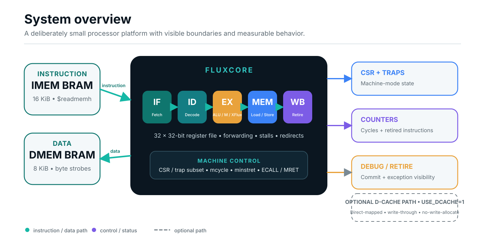
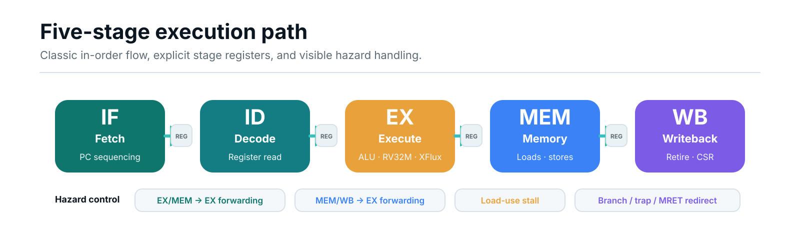
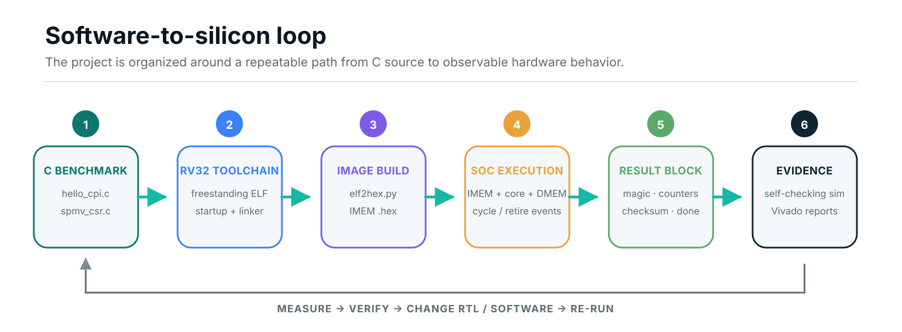
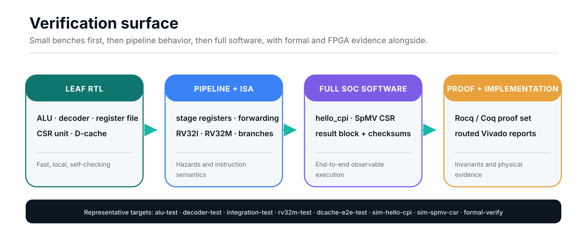

<p align="center">
  
</p>

<p align="center">
  
  
  
  
  
</p>

<p align="center"><strong>FluxCore is a handwritten RISC-V processor that owns the entire path from bare-metal C to a routed FPGA bitstream.</strong></p>

FluxCore is intentionally small enough to inspect and complete enough to measure. The repository combines a five-stage RV32 pipeline, machine-mode counters and traps, RV32M execution, XFlux custom instructions, BRAM-backed SoC integration, bare-metal benchmarks, directed simulation, Rocq/Coq proof artifacts, and saved Vivado implementation evidence.

The goal is not to hide complexity behind generated IP. The goal is to make every important boundary—fetch, decode, hazards, memory, retirement, software images, checksums, timing, and utilization—visible and reproducible.

> **Design question:** Can a custom-instruction RISC-V processor remain understandable while still spanning compiler integration, bare-metal software, verification, and physical FPGA implementation? FluxCore is built as a concrete vertical slice of that answer.

## Contents

- [Why FluxCore](#why-fluxcore)
- [The complete system](#the-complete-system)
- [Five-stage pipeline](#five-stage-pipeline)
- [ISA surface](#isa-surface)
- [Harvard memory system](#harvard-memory-system)
- [Software-to-silicon loop](#software-to-silicon-loop)
- [Verification surface](#verification-surface)
- [FPGA implementation snapshot](#fpga-implementation-snapshot)
- [FluxCC integration](#fluxcc-integration)
- [Quick start](#quick-start)

---

## Why FluxCore

<table>
<tr>
<td width="33%" valign="top">
<h3>Inspectable</h3>
A compact, explicit microarchitecture with handwritten stage logic, forwarding, stalls, redirects, CSR state, and local memories.
</td>
<td width="33%" valign="top">
<h3>Measurable</h3>
Benchmarks report cycle count, retired instructions, checksums, and completion through a fixed DMEM result block.
</td>
<td width="33%" valign="top">
<h3>Extensible</h3>
The base RV32I/RV32M machine is paired with XFlux helpers and an optional parameterized direct-mapped D-cache path.
</td>
</tr>
</table>

## At a glance

| Processor | Memory | Software | Evidence |
|---|---|---|---|
| 5-stage, in-order, single-issue RV32 | 16 KiB IMEM + 8 KiB DMEM BRAM | Bare-metal C startup, linker, runtime, benchmarks | Directed RTL/SoC tests, formal targets, routed Vivado reports |
| RV32I + RV32M + XFlux | Optional write-through D-cache | ELF → IMEM hex conversion | 3,313 LUTs, 2,003 registers, 2.5 BRAM tiles |
| Machine CSR/trap subset | Byte-enabled data writes | `hello_cpi` and 8×8 CSR SpMV | WNS 3.780 ns at 50 MHz; all 4,844 routable nets routed |

---

## The complete system

<p align="center">
  
</p>

The default measured configuration is deliberately direct: `fluxcore_soc` exposes only `clk` and `rst`, attaches the processor to local instruction and data BRAMs, and keeps retirement and exception events visible for debug. The optional D-cache is available behind `USE_DCACHE=1`, but the routed FPGA snapshot in this README is the cacheless BRAM-first SoC.

### Core contract

| Property | Current implementation |
|---|---|
| Datapath | 32-bit |
| Register file | 32 × 32-bit, asynchronous read, synchronous write, hardwired `x0` |
| Reset | Synchronous, active-high internal reset |
| Reset vector | `0x0000_0000` |
| Trap vector | `0x0000_0100` |
| Top level | `rtl/top/fluxcore_soc.sv` |
| FPGA ports | `clk`, `rst` |
| Debug visibility | Internal `dbg_*` retirement and exception signals preserved |

---

## Five-stage pipeline

<p align="center">
  
</p>

FluxCore uses explicit IF, ID, EX, MEM, and WB stage registers. The control path handles EX/MEM and MEM/WB forwarding, load-use stalls, branch and jump redirects, trap/MRET redirects, and stall inputs from the divider or optional cache path.

| Stage | Main RTL | Responsibility |
|---|---|---|
| IF | `rtl/frontend/fetch_unit.sv` | PC sequencing and instruction fetch timing |
| ID | `rtl/decode/decoder.sv`, `rtl/common/regfile.sv` | Decode, immediate generation, register reads |
| EX | `rtl/execution/alu.sv`, `branch_unit.sv`, `mul_div_unit.sv` | Integer ALU, branches, jumps, RV32M, XFlux |
| MEM | `rtl/memory/mem_stage.sv` | Load/store alignment, byte lanes, memory control |
| WB | `rtl/core/wb_stage.sv`, `csr_unit.sv` | Register writeback, CSR effects, retirement |
| Control | `pipeline_ctrl.sv`, `forwarding_unit.sv` | Hazards, forwarding, stalls, redirects |

---

## ISA surface

FluxCore implements the parts of RISC-V needed for a compact bare-metal measurement platform, then adds a small custom helper surface in the standard `CUSTOM_0` opcode space.

| Group | Implemented instructions |
|---|---|
| RV32I ALU | ADD, SUB, AND, OR, XOR, SLL, SRL, SRA, SLT, SLTU and immediate forms |
| RV32I memory | LW, LH, LB, LHU, LBU, SW, SH, SB |
| Control flow | BEQ, BNE, BLT, BGE, BLTU, BGEU, JAL, JALR, LUI, AUIPC |
| System | ECALL, EBREAK, MRET, WFI (executes as NOP), CSR read/write/set/clear forms |
| RV32M multiply | MUL, MULH, MULHU, MULHSU |
| RV32M divide | DIV, DIVU, REM, REMU through a 33-cycle iterative divider |
| XFlux | XLIDX, XABS, XMIN, XMAX, XCLZ |

The machine CSR set includes `mstatus`, `misa`, `mie`, `mtvec` (direct + vectored), `mcounteren`, `mcountinhibit`, `mscratch`, `mepc`, `mcause`, `mtval`, `mip`, the 64-bit `mcycle`/`minstret` counters, the Zicntr read-only shadows (`cycle`, `time`, `instret` + high halves, with `time` backed by the CLINT), and the machine-information registers (`mvendorid`, `marchid`, `mimpid`, `mconfigptr`, `mhartid`).  Accesses to unimplemented CSRs and writes to read-only CSRs raise illegal-instruction exceptions at decode.

Machine interrupts are implemented end-to-end: a Spike-layout CLINT (`msip`, `mtimecmp`, `mtime` at 0x0200_0000) drives level-sensitive `mip.MTIP/MSIP`; an enabled pending interrupt tags the instruction leaving EX (never WB — stores commit at the end of MEM), traps through `mtvec` with `mepc` on the first un-executed instruction, and returns via MRET.  `sim-timer-irq` demonstrates three timer interrupts through a real C trap handler.

> **Why the counters matter:** the benchmark runtime reads machine counters directly, so cycle count, retired instructions, and CPI can be collected without an operating system or external host controller.

---

## Harvard memory system

<p align="center">
  
</p>

IMEM and DMEM both begin at address zero because they are separate physical BRAM buses rather than one unified address space.

| Memory | Default depth | Byte range | Purpose |
|---|---:|---|---|
| IMEM | 4096 words | `0x0000_0000`–`0x0000_3FFF` | 16 KiB program image loaded with `$readmemh` |
| DMEM | 2048 words | `0x0000_0000`–`0x0000_1FFF` | 8 KiB byte-enabled data memory |
| Stack | — | grows down from `0x0000_2000` | Initialized by `software/startup/crt0.S` |
| Result block | 8 words | `0x0000_1FE0`–`0x0000_1FFF` | Counters, checksum, extras, completion sentinel |

<details>
<summary><strong>Optional direct-mapped D-cache</strong></summary>

| Property | Value |
|---|---|
| Organization | Direct-mapped |
| Line size | One 32-bit word |
| Default line count | 64 |
| Write policy | Write-through, no-write-allocate |
| Load miss behavior | One added stall cycle, then refill from BRAM |
| Counters | 32-bit wrapping hit and miss counters |

The cache path is instantiated by `rtl/top/fluxcore_soc.sv` when `USE_DCACHE=1`.
</details>

---

## Software-to-silicon loop

<p align="center">
  
</p>

| Component | Path | Role |
|---|---|---|
| Startup | `software/startup/crt0.S` | Entry point, stack setup, BSS clearing, call `main` |
| Linker | `software/linker/fluxcore.ld` | Places code in IMEM and exports the DMEM stack top |
| Runtime | `software/runtime/fluxcore.h` | Reads counters and writes the result block |
| Image conversion | `scripts/elf2hex.py` | Converts ELF into `$readmemh`-compatible IMEM hex |
| Benchmarks | `software/benchmarks/*.c` | End-to-end workloads for simulation and measurement |

### Current benchmark programs

| Program | Workload | Correctness signal |
|---|---|---|
| `hello_cpi.c` | 1000-iteration arithmetic loop bracketed by counter reads | checksum `499500`, CPI 1.599 |
| `spmv_csr.c` | 8×8 integer sparse matrix-vector multiply in CSR form | checksum `416` |
| `csr_probe.c` | raw mcycle/minstret read diagnostic (guards the counter path) | monotonic raw counter values |
| `hello_uart.c` | prints a banner over the memory-mapped UART, drives the LEDs | TB decodes "hello from fluxcore" from the TX line |
| `timer_irq.c` | takes 3 CLINT timer interrupts through a C trap handler | checksum `3`, mcause `0x80000007` |
| `misalign_trap.c` | JALR to a misaligned target, handler skips and resumes | checksum `1`, mcause `0`, mtval `0x102` |
| `xflux_kernel.c` | indexed-gather clamp reduction, scalar vs XFlux (`.insn` intrinsics) | identical checksums; 1220 → 706 cycles (1.73×) |
| `board_hello.c` | Zybo bring-up: UART banner + timer-interrupt LED counter | visual/serial, see `reports/benchmarks/board-bringup.md` |

The runtime reports through a fixed memory structure:

```text
RESULT_BASE + 0   magic     0xF10CCAFE
RESULT_BASE + 4   cycles
RESULT_BASE + 8   retired instructions
RESULT_BASE + 12  checksum
RESULT_BASE + 16  extra0
RESULT_BASE + 20  extra1
RESULT_BASE + 24  extra2
RESULT_BASE + 28  done      0x600DD00E
```

The full-SoC benchmark testbench watches stores to this region, prints cycles, instructions, CPI, and checksum, verifies correctness, and finishes when the done sentinel appears.

---

## Verification surface

<p align="center">
  
</p>

Verification is organized as a progression from small, fast, local checks toward complete software execution and physical implementation evidence.

| Layer | Representative targets |
|---|---|
| Leaf RTL | `alu-test`, `decoder-test`, `regfile-test`, `csr-unit-test`, `dcache-sim` |
| Pipeline control | `if-id-reg-test`, `id-ex-reg-test`, `pipeline-ctrl-test`, `forwarding-unit-test` |
| ISA integration | `rv32i-alu-test`, `rv32m-test`, `branch-compare-test`, `jal-jalr-test` |
| Memory integration | `lw-sw-test`, `byte-halfword-test`, `bram-imem-test`, `bram-dmem-test`, `dcache-e2e-test` |
| Control and traps | `branch-integ-test`, `lui-auipc-test`, `ecall-mret-test` |
| Full SoC software | `sim-hello-cpi`, `sim-spmv-csr` |
| Formal | `formal-verify` |

`make regress` runs every self-checking simulation target with one command and writes a dated summary to `reports/simulation/` — a passing regression is a committed artifact, not a README claim.

The formal set (`make formal-verify`) is organized ModularKoika-style under `verification/formal/` — `Common/` (word + register-file algebra), `Spec/` (sequential ISA semantics), `Impl/` (models of the forwarding pipeline and the CSR counter update), `Refine/<Module>/Top.v` (each Impl refines its Spec), and `Kernels/SPMV.v` (the SpMV CSR loop terminates with the exact dot product; instantiated on the 8×8 benchmark with checksum 416).  Everything shipped is **Qed-complete**: `verification/scripts/check_no_admitted.sh` gates the build (and CI) on zero `Admitted`/`admit`/`Axiom` outside `wip/`.  These are proofs about hand-written models of the RTL, not the SystemVerilog itself; see `verification/formal/README.md` for the precise claims.

---

## FPGA implementation snapshot

<p align="center">
  
</p>

The saved implementation snapshot targets the Zybo Z7-20 (`xc7z020clg400-1`) with Vivado 2023.1 and a 20 ns clock constraint.

| Metric | Routed `fluxcore_soc` result |
|---|---:|
| Slice LUTs | 3,313 / 53,200 = 6.23% |
| Slice registers | 2,003 / 106,400 = 1.88% |
| Block RAM tiles | 2.5 / 140 = 1.79% |
| DSPs | 0 / 220 = 0.00% |
| Routable nets | 4,844 / 4,844 fully routed |
| Timing | WNS 3.780 ns, TNS 0.000 ns |
| Bitstream output | `build/vivado/fluxcore_soc.bit` |

<details>
<summary><strong>Implementation evidence files</strong></summary>

- `reports/implementation/fluxcore_soc_utilization_route.rpt`
- `reports/implementation/fluxcore_soc_timing_summary_route.rpt`
- `reports/implementation/fluxcore_soc_route_status.rpt`
- `reports/implementation/fluxcore_soc_drc_bitstream.rpt`
- `reports/synthesis/direct_mapped_cache_utilization_synth.rpt`
- `reports/synthesis/direct_mapped_cache_timing_summary_synth.rpt`
</details>

---

## FluxCC integration

The connected compiler target profile is:

```text
fluxcore-bram-rv32imxflux-v0
```

The bring-up profile is RV32I/RV32M/XFlux-scalar, single-hart, BRAM-backed, and integer-only. It intentionally excludes floating point, hardware threading, DMA, AXI/DDR, hosted libc, C++ exceptions, RTTI, gather/scatter helpers, and PCG until corresponding processor and runtime support exists.

```text
C / restricted C++
  → frontend representation
  → FluxIR
  → FluxCore Machine IR
  → GNU RV32 assembly
  → ELF
  → scripts/elf2hex.py
  → fluxcore_soc IMEM_INIT
```

Integration documents:

- `docs/compiler/fluxcc-integration.md`
- `docs/compiler/fluxcore-target-v0.yaml`
- `docs/compiler/chatgpt-prompt.md`

---

## Quick start

### 1. Set up local tooling

```bash
make setup
source .venv/bin/activate
make check

cp config/tools.example.mk config/tools.local.mk
cp config/board.example.mk config/board.local.mk
make show-config
```

### 2. Build software images

```bash
make sw-all
```

### 3. Run representative simulation targets

```bash
make integration-test
make rv32i-alu-test
make rv32m-test
make byte-halfword-test
make branch-compare-test
make dcache-e2e-test
make sim-hello-cpi
make sim-spmv-csr
```

### 4. Compile formal artifacts

```bash
make formal-verify
```

### 5. Run the FPGA flow

```bash
make vivado-check
make vivado-synth
make vivado-impl
make vivado-bitstream
make vivado-cache-synth
```

### 6. Regenerate README visuals

```bash
python3 scripts/generate_readme_assets.py
```

---

## Repository map

```text
FluxCore/
├── rtl/
│   ├── common/        architectural packages and shared leaf units
│   ├── core/          pipeline top, CSR unit, control, forwarding, writeback
│   ├── decode/        instruction decoder
│   ├── execution/     ALU, branch unit, RV32M unit, execute stage
│   ├── frontend/      fetch unit
│   ├── memory/        memory-stage datapath
│   ├── pipeline/      stage registers
│   ├── cache/         direct-mapped data cache blocks
│   └── top/           BRAM memories and fluxcore_soc
├── verification/      SystemVerilog tests, filelists, Rocq/Coq proofs
├── software/          startup, linker, runtime, benchmarks
├── vivado/            constraints and non-project Tcl scripts
├── synth/             synthesis filelists and report analysis
├── reports/           saved synthesis and implementation evidence
├── docs/
│   └── compiler/      FluxCC target contract and machine profile
├── models/            Python support model and tests
├── scripts/           image generation and project utilities
├── config/            example and local tool/board configuration
└── figures/           README artwork and technical diagrams
```

---

## Current boundaries

FluxCore does **not** currently claim:

- AXI/DDR or ARM Processing System host integration
- an operating system, virtual memory, or multicore coherence
- superscalar issue or out-of-order execution (a permanent design exclusion)
- floating-point execution
- RISCOF/riscv-arch-test compliance runs (planned; the CLINT already uses Spike's layout)
- RTL-level formal (RVFI + riscv-formal is the planned bridge; the Coq proofs cover hand-written models)

`XMACC` is intentionally unimplemented (it needs a third register-file read port).  "FluxCC" is a de-scoped design sketch under `docs/compiler/` — all software builds with stock `riscv64-unknown-elf-gcc`, including the XFlux instructions via `.insn` intrinsics (`software/runtime/xflux.h`).  The checked-in routed reports describe the default BRAM-first configuration; the D-cache configuration is regression-tested in simulation (`sim-*-dcache`).

Performance, timing, utilization, and correctness claims in this README should be backed by checked-in source, Makefile targets, or saved reports under `reports/`; generated local build logs are not treated as canonical project evidence.
